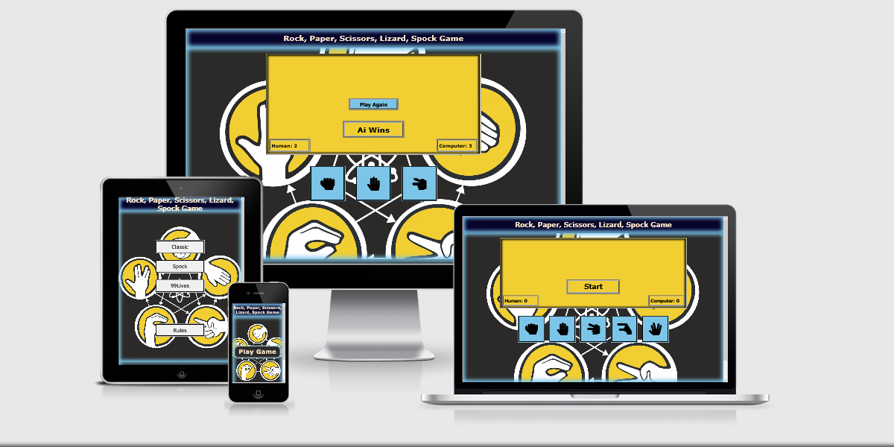

# Rock, Paper, Scissors, Lizard, Spock Game

## Demo

A live demo of the site can be found  [here](https://guidosillaste.github.io/rock-paper-scissor/)

## Table of contents

- [User Stories](#User-Stories)
- [Design](#Design)
- [Colour Scheme](#Colour-Scheme)
- [Typography](#Typography)
- [Images](#Images)
- [Features](#Features)
- [Technologies Used](#Technologies-Used)
  - [Languages](#Languages)
  - [Programs](#Programs)
- [Testing](#Testing)
- [Deployment](#Deployment)
- [Credits](#Credits)
  - [Content](#Content)
  - [Media](#Media)
  - [Code](#code)

## User Stories

### External user’s goal

- The site’s users want to play an online game that has elements of chance.
- The site’s users want to play an online game that has diffrent levels.
- The site’s users want to leave a feedback.
- The The site’s users want to play again.

### Site owner's goal

- The site’s goal is to provide a challenging game with increasing levels of difficulty to entertain online users.
- To learn javascript.
- To gain feedback.

### Potential features to include

- Pattern matching functionality
- A limited number of tries before the game is over
- A score tracking system
- The ability to play against the computer

### Design

### Wireframes

Figma was used to a lesser extent to make wireframes.
[here](assets/wireframes)

#### Colour Scheme

The main colours used throughout the website are a mixture of rgb(255, 235, 205), #2b2a28, #7cc5e8, #f1ce32 and white.

#### Typography

Main fonts used are Verdana and Tahoma which are browser native and the Sans Serif as the fallback font in case of not being supported failure.

#### Images

only 2 images were used one for background and other to describe the rules.

### Features

The features of the site are very basic. Navigation bar stays at the top allowing to access all parts of the site. Footer stays at the bottom of the page giving people the option to navigate to contact page. Landing page is simple whit a opening hero image followed by a herbalist intro and 3 sample plants. medical plants page is again starts whit a hero and is followed by 3x4 boxes of plants based on there difficulty to get. ON about page i make a simple intro to why the page would be benefit you.On contact page i give you a chance to fill in a form if you want to add a plant and why and contact table.

- Navigation Bar
- navigation bar stays at the top of the screen.On smaller screens the icon moves from navbar to the top of navbar.
![Navigation Bar]

- Footer
- The footer has 4 fontawesome icons for facebook, instagram, youtube and twitter and are connect to respective homepages.Footer stays at the bottom of the screen even if no content.
![Footer]

- Landing page
- Landing page has a starting medical plant that is well known but not used for its medical benefits.Background color isset to lightclay.It has one video file that slows the page down a bit and gives 3 more intros to well known plants.
![homepage]

- Medical page
- On this page i added 12 more plants,each whit lowerd accessibility caoused by restriction put on em.
![medicalpage]

- About page
- Here i simply added reasons to why the site was made.
![aboutpage]

- Contact page

#### Features left to implement

- Plan to change last of the difficulties to 8 hand moves.
- Adding a top score board.
- Increasing lives and difficulty settings.
- Ability to change color options.
- Adding more text to the game .

### Technologies Used

#### Languages

- HTML
- CSS
- Pen, Paper and English
- Javascript

#### Programs

- little wireframes.
- Pen and Paper wireframes.
- Virtual code studio for code.
- Git to store the code changes.
- Github used to store the repository.
- Fontawesome used for icons.
- famicon.io for famicon.
- Emailjs.
- W3C Markup validation and W3C Jigsaw CSS validation.
- JShint.

### Testing

Basic user testing works.

Ran in to a lot of difficulties whit CSS which took up 50% of the coding time other half divided to 20% javascript and html, the rest 30% looking up info on emailjs tutorials and trying to implement my more radical ideas which sadly did not come to life since they were not written in plain javascript.

During testing box images did nothold size properly so had to add lots of media queries, buttons did not stay in place.

Multiple times javascript did return undefined. This was mainly caused by multiple ids whit same name or inline style not behaving.

The live site has been tested on Firefox. The site has also been tested on several devices using dev tools to confirm that its responsive on all devices.

## Validator Testing

- HTML 2 warnings were returned when passing through the official [W3C validator] since they were left embty to store javascript values.
[result](assets/validations/game.png)
- CSS no errors were returned when passing through the official [Jigsaw validator]

[Here](assets/validations/jigsawvalidator.png)

## Lighthouse Testing

I ran several tests in Lighthouse and noticed that the performance was high, the reason for this was that the actual content was 2 picture and a game.  The score for Desktop was higher than for Mobile but I am satisfied with the results.

For more lighthousetests go [Here](assets/validations)

### Deployment

This site was deployed using GitHub Pages with the following the steps below:

1. Login or Sign Up to [GitHub](https://github.com/login "Link to GitHub login page")
2. Create a new repository named "medical-plant-site".
3. Once created, click on "Settings" on the navigation bar under the repository title.
4. Click on "Pages", on the left hand side below Secrets.
5. Under "Source" choose branch you wish to deploy in most cases it will be "main".
6. Choose which folder to deploy from, generally from "/root".
7. Click "Save", then wait for it to be deployed.
8. The URL will be displayed above the "source" section in GitHub Pages.

### Credits

#### Content

- Email sending JavaScript API code was written with the help of the official EmailJS tutorial [Emailjs](https://www.emailjs.com/docs/tutorial/creating-contact-form/)
- The fonts were taken from [Google fonts](https://fonts.google.com/).
- The icons in the footer were taken from [Fontawesome](https://fontawesome.com/).
- Help with coding was taken from [https://www.w3schools.com/]

#### Media

- The image from the landing page was taken from [bing](https://www.bing.com)

#### Code

I looked in multiple sites in order to better understand the code i was trying to implement.

The following sites were used on a more regular basis:

- [Stack Overflow](https://stackoverflow.com/ "Link to Stack Overflow page")
- [W3Schools](https://www.w3schools.com/ "Link to W3Schools page")

## Acknowledgement

Self learned. Mentor Mo helped me to notice what was still lacking in the project.
